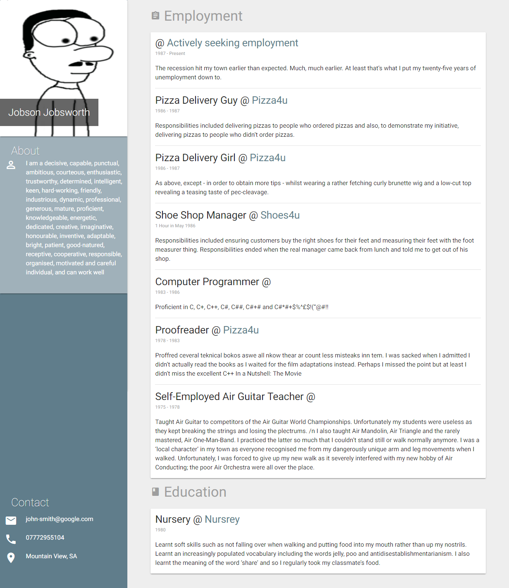
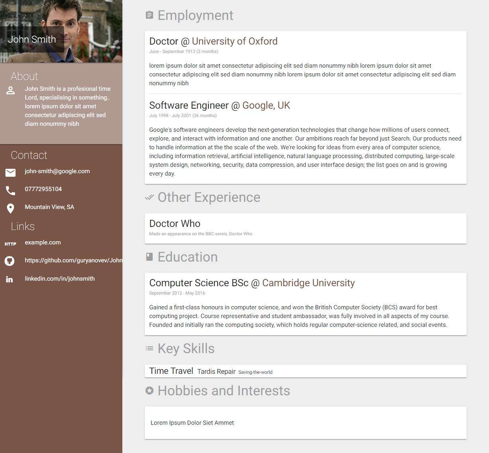

# Material Design CV Template

> A highly customisable template for a single-page material design CV website

## Basic Usage

1. **Clone from Git**
    `https://github.com/Lissy93/md-cv-maker.git`

2. **Install Dependencies** 
    `npm install`

3. **Add content** 
    Populate the `src/locals.json` with your content. 
    _(There are some example locals.json files in the examples directory)_

4. **Build**
    `npm run build`

5. **View**
    Once the project is built, open `production/index.html` in your browser.


## Modifying the Template

Run `npm run watch` to watch files, and rebuild the project on change 

_It should only be necissary to edit files within the `src/` directory._


## Examples
For a live demo, feel free to take a look at my CV, made using this code, at:
[AliciaSykes.com/cv](http://aliciasykes.com/cv/)





## File Structure
```
    .
    +-- node_modules                // Just the node_modules
    +-- examples                    // Couple of example locals.json for you to see
    +-- production                  // All production/ compiled code (this is what gets generated)
        |   +-- bower_components    // Production - libraries
        |   +-- assets              // Production - assets (such as images)
        |   +-- css                 // Production - compiled CSS 
        |   +-- js                  // Production - compiled JavaScript
        |   +-- index.html          // Production - main entry point/ CV homepage
        
    +-- src                         // All source files (this is what you edit)
        |   +-- assets              // Source - original assets, such as images
        |   +-- scripts             // Source - any scripts, CoffeeScript, JavaScript of TypeScript
        |   +-- styles              // Source - any styles, CSS or SASS
        |   +-- views               // Source - all view fragments, Pug/ Jade
        |   +-- locals.json         // Source - the actual data for your CV
        
   +-- .bowerrc                     
   +-- .gitignore                   
   +-- bower.json
   +-- gulpfile.js
   +-- package.json
   +-- readme.md
   +-- server.js                // If you require a web server, then run node server to launch app
   
```